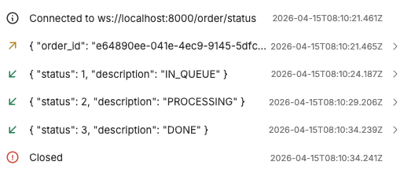

# Requirements
- Linux environment or using WSL.
- Docker & Docker Compose.
- GNU Make.

# Installation
- Ensure current directory is in `./backend`.
- For first time installation, simply use `make install`.

# Running services
- To run services, run `docker compose up -d` or `make services-up`.
- To stop services, run `docker compose down` or `make services-down`.
- Notes: change the environment variables in `env.template` to your likings or you can just
keep it as is.

# Frontend connection
- There are two ways to connect to the api:
    - Via localhost:8000 if the frontend is not built with docker.
    - Via joining `irms-frontend` network then change the api host to `irms-gateway:8000`.

# Currently available API endpoints
## Menu
### List items in menu
- Description: List the available items in the menu.
- Endpoint: `/menu/list_items`.
- Method: GET.
- No parameters required.
- Example request and result:
```
# Request:
curl --request GET \
  --url http://localhost:8000/menu/list_items

# Response:
[
  {
    "id": 1,
    "name": "Gỏi Ngó Sen Tôm Thịt",
    "description": "Gỏi thanh mát, tôm thịt đậm đà",
    "price": 115000.0,
    "type_name": "Khai vị",
    "image_base64": "utf-8 encoded base64 image"
  },
  ...
]
```

### Check item's remaining portions
- Description: Check the remaining portions of a specific item in the menu.
- Endpoint: `/menu/remaining_portions`.
- Method: GET.
- Parameters: `item_id`.
- Example request and result:
```
# Request
curl --request GET \
  --url 'http://localhost:8000/menu/remaining_portions?item_id=1' \
  --header 'content-type: application/json'

# Response
{
  "remaining_portions": 33
}
```

## Order
### Make orders
- Description: Make orders to the server -> Return the same orders information
but with additional order's id as `id` in the response.
- Endpoint: `/order/create`.
- Method: POST.
- Body: json.
- Example request and result:
```
# Request
curl --request POST \
  --url http://localhost:8000/order/create \
  --header 'content-type: application/json' \
  --data '[
  {
    "item_id": 1,
    "table_id": 0,
    "amount": 1
  }
]'

# Response
[
  {
    "item_id": 1,
    "table_id": 0,
    "amount": 1.0,
    "id": "15bdafa4-0203-4664-a9ab-2570ba1e25f3"
  }
]

Notes: about the `table_id` field, just keep it at 0 (Không xác định) for simplicity.
```

### Get order's status
- Description: Open a websocket to the server to update the order's status.
- Endpoint: `/order/status`.
- Method: Websocket.
- Steps to use this endpoint:
    1. Open a normal websocket to the server via, for example, `ws://localhost:8000/order/status`.
    2. Send a json object as message: `{"order_id": "<id obtained from the /order/create endpoint>"}`
    3. The websocket should receive updating messages of the following format:
    `{"status": int, "description": str}`
    If the `status == 3`, that means the websocket ends and the order is completed.
- Example websocket messages:



# Testing
## Test Framework: pytest

## Test Covered:
1. Order API/Websocket flows: `backend/tests/test_order_router.py:80`
2. HTTP client lifecycle: `backend/tests/test_httpx_client.py:6`
3. MQTT queue lifecycle and invalid device path: `backend/tests/test_mqtt_queue.py:8`
4. All SQLAlchemy models: `backend/tests/test_models.py:1`

## Happy Path Test:
1. Create order successfully: `backend/tests/test_order_router.py:80`
2. WebSocket order status sucess: `backend/tests/test_order_router.py:129`
3. WebSocket order status v2 success: `backend/tests/test_order_router.py:155`
4. HTTPX client init/close success: `backend/tests/test_httpx_client.py:6`
5. MQTT client init/close and standalone creation success: `backend/tests/test_mqtt_queue.py:8`, `backend/tests/test_mqtt_queue.py:42`

## Edge Case Tests:
1. Empty order list: `backend/tests/test_order_router.py:104`
2. Invalid device path (MQTT publish failure / client not initialized): `backend/tests/test_order_router.py:173`, `backend/tests/test_mqtt_queue.py:32`
3. Null values (invalid payload with item_id=None): `backend/tests/test_order_router.py:118`
4. Empty order_id websocket input: `backend/tests/test_order_router.py:144`

## Test Command: 
python3 -m pytest backend/tests --cov=routers.order --cov=httpx_client --cov=mqtt_queue --cov=model --cov-report=term-missing